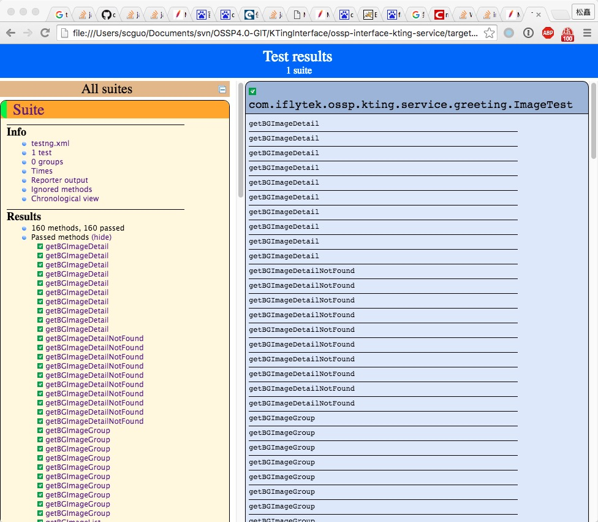

##Maven failsafe plugin 的使用

```
---
layout: post
title: Maven failsafe plugin 的使用
---
```
Maven failsafe plugin 是一个做整合测试（集成测试、翻译水平有限）的插件；

通过使用failsafe 插件+ tomcat插件+ testng，可以达到一种效果：在构建时执行单元测试前可以启动一个tomcat来部署服务，这样单元测试的地址可通，执行测试后关闭服务；

配置如下：

pom.xml 的 build插件

```xml
<plugins>
  <!--指定单元测试不执行 否则先执行单元测试 地址不通-->
  <plugin>
    <groupId>org.apache.maven.plugins</groupId>
    <artifactId>maven-surefire-plugin</artifactId>
    <version>2.18</version>
    <configuration>
      <skip>true</skip>
    </configuration>
  </plugin>
  <!--集成测试的插件配置-->
  <plugin>
    <groupId>org.apache.maven.plugins</groupId>
    <artifactId>maven-failsafe-plugin</artifactId>
    <version>2.19.1</version>
    <configuration>
      <suiteXmlFiles>
        <!--指定配置文件-->
        <suiteXmlFile>testng.xml</suiteXmlFile>
      </suiteXmlFiles>
    </configuration>
    <executions>
      <execution>
        <id>integration-tests</id>
        <goals>
          <goal>integration-test</goal>
          <goal>verify</goal>
        </goals>
      </execution>
    </executions>
  </plugin>
  <!--tomcat插件-->
  <plugin>
    <groupId>org.apache.tomcat.maven</groupId>
    <artifactId>tomcat7-maven-plugin</artifactId>
    <version>2.2</version>
    <!--部署的端口和配置-->
    <configuration>
      <port>8080</port>
      <path>/</path>
    </configuration>
    <executions>
      <!--什么时候启动 什么时候终止-->
      <execution>
        <id>tomcat-run</id>
        <goals>
          <goal>run-war-only</goal>
        </goals>
        <phase>pre-integration-test</phase>
        <configuration>
          <fork>true</fork>
        </configuration>
      </execution>
      <execution>
        <id>tomcat-shutdown</id>
        <goals>
          <goal>shutdown</goal>
        </goals>
        <phase>post-integration-test</phase>
      </execution>
    </executions>
  </plugin>
</plugins>
```

testng.xml

```xml
<?xml version="1.0" encoding="UTF-8"?>
<suite name="Suite" parallel="true">
    <!--greeting-->
    <test name="duplicatedNewsTest">
        <classes>
            <class name="com.iflytek.ossp.kting.service.greeting.ImageTest"/>
            <class name="com.iflytek.ossp.kting.service.greeting.MusicTest"/>
        </classes>
    </test>
</suite>
```

执行后可以在target下面看到执行的结果


